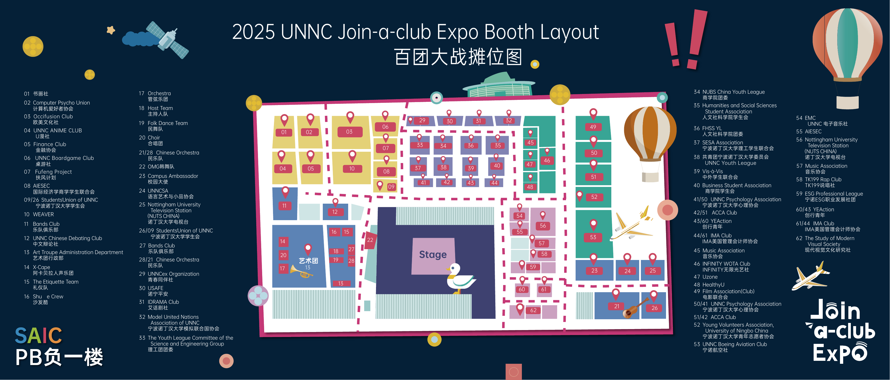
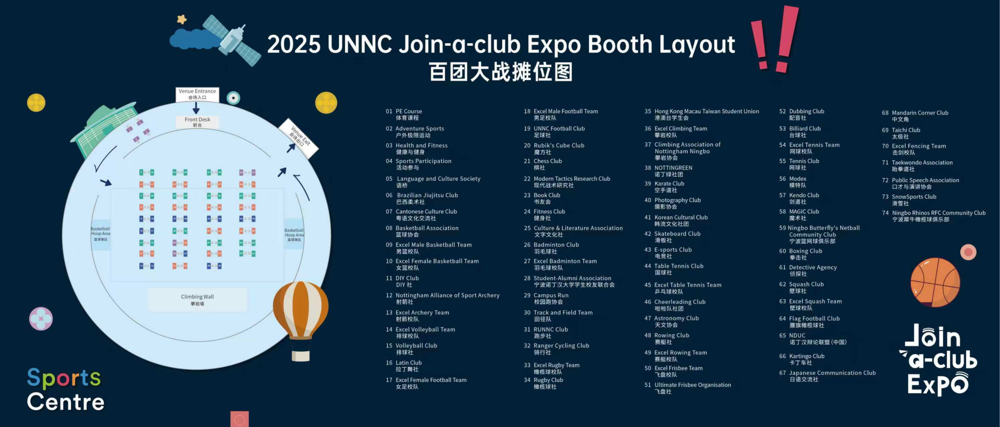

# 体育与社团

## 体育课

学校体育课的种类很多。根据 2025/26 学年春季学期课表，可选项目包括：

- 篮球、排球、足球、腰旗橄榄球
- 羽毛球、网球、乒乓球、壁球、匹克球、木球
- 射箭、击剑、拳击、攀岩
- 飞盘、瑜伽、体适能

其中篮球、羽毛球、乒乓球、网球、壁球、瑜伽和攀岩等项目还可能开设 Level 2 课程。实际开放项目、上课时间和名额会按学期调整，选课时以当学期发布的体育课表为准。

## UnncSportsCenter 小程序

在微信中搜索 `UnncSportsCenter` 小程序。它主要用于抢体育课、报名各类体育活动，以及在学期末查询体育成绩。

首次使用前需要完成注册，有两种方式：

1. **线上注册：**直接在小程序中填写并提交个人信息，等待工作人员审核。通常约需半天；周末可能更久，因为值班人员较少。
2. **现场注册：**前往体育馆前台请工作人员办理，通常现场就能完成，速度更快。

除正式体育课外，学校还会提供 HIIT、健身课等活动。这类课程通常需要提前在小程序中预约或抢位，名额可能很快报满。开放时间、预约入口和取消规则以体育部当期通知为准。

## 额外付费项目

学校有时还会组织冲浪、越野摩托等校外体验项目。这些活动不属于常规免费体育课，通常需要额外付费，项目内容和价格以每次活动通知为准。

## 健身房

校内健身房对学生免费开放。

## 学生社团

宁诺有约 100 个学生社团，数量很多，不适合在这里逐一列出。社团名单和招新情况可能按学年调整，具体以当年发布的信息为准。

下面是 2025 年百团大战摊位图，可以用来了解学校社团和学生组织的大致种类。

[查看 2025 年百团大战摊位图 PDF](../assets/documents/2025-join-a-club-expo-map.pdf){ .resource-link }
