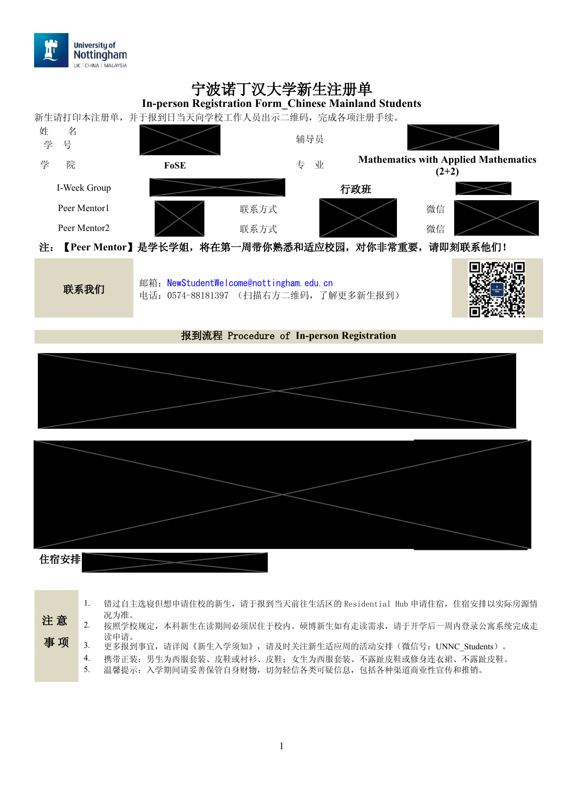

# 迎新周 / iWeek

## iWeek 是什么

iWeek 指校历中的 **Registration & Introduction**。2026 级新生适应周为 **9 月 21 日至 9 月 27 日**。

## 新生注册单

新生注册单上会标明你所在的 iWeek 小组，以及两位 iWeek Peer Mentor（下称 **PM**）的信息。

[查看新生注册单样式](../assets/documents/register-form.pdf){ .resource-link }

!!! note "样式示例"
    上方文件仅用于展示新生注册单的版式和信息位置，实际分组及 PM 信息请以你本人收到的注册单为准。

## iWeek Peer Mentor

你的两位 PM 会在报到前后通过邮件联系你，通知你加入微信群。

在 iWeek 期间，他们会找时间带着小组成员逛逛学校，帮助大家熟悉校园里各栋楼的位置和作用，以及分享一些学校老东西们的焚诀。

## 三大学院新生衔接课

学校三大学院为本科新生准备了线上衔接课程，建议在完成 IT 账号激活后登录 [Moodle](https://moodle.nottingham.ac.uk/) 查看。

### 诺丁汉大学商学院（中国）

商学院新生衔接课是一门线上适应课程，用于帮助新生从中学学习过渡到大学的学术环境和学习体系。课程入口以商学院通知、官方微信公众号和 Moodle 为准。

### 人文与社会科学学院

人文社科学院衔接课围绕心态准备、核心技能储备和专业探索展开，帮助新生了解大学学习节奏、学院课程体系和未来方向。课程在 Moodle 上发布。

### 理工学院

理工学院提供面向本科新生的自主研习线上课程，帮助新生完成学术知识与核心技能的衔接。完成线上注册并激活 IT 账号后，可登录 Moodle 查看。

!!! note "以学院通知为准"
    不同学院的课程名称、开放时间和完成要求可能不同。请优先查看学校邮箱、学院微信公众号及 Moodle 中的最新说明。
