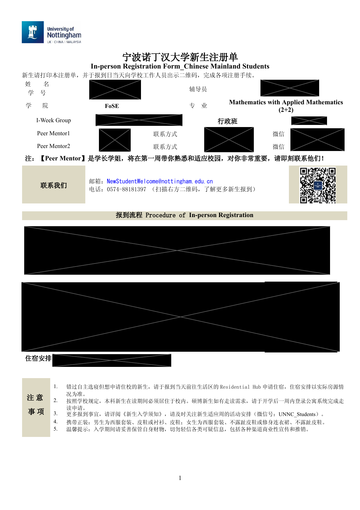

# 迎新周 / iWeek

## iWeek 是什么

iWeek 指校历中的 **Registration & Introduction**。2026 级新生适应周为 **9 月 21 日至 9 月 27 日**。

## 新生注册单

新生注册单上会标明你所在的 iWeek 小组，以及两位 iWeek Peer Mentor（下称 **PM**）的信息。

[查看新生注册单样式](../assets/documents/register-form.pdf){ .resource-link }

!!! note "样式示例"
    上方文件仅用于展示新生注册单的版式和信息位置，实际分组及 PM 信息请以你本人收到的注册单为准。

## iWeek Peer Mentor

PM 项目全称为 **Peer Mentor（朋辈导师）项目**，是学校官方迎新活动中的重要环节。学校会根据学院和专业为大家自动匹配 PM。在暑期以及开学后的一段时间里，PM 会为大家提供包括但不限于预注册指导、学校官方通知传达和校园导览等帮助，协助大家尽快适应学校环境。

<strong>你的两位 PM 会在八月中下旬通过邮件联系你，请及时查收邮件。</strong>

往年 PM 普遍反馈部分新生加群不够及时，因此请优先留意学校邮箱，不要只等待微信群通知。在 iWeek 期间，PM 还会带着小组成员熟悉校园里各栋楼的位置和作用，并分享一些校园经验。

## 三大学院新生衔接课

学校三大学院为本科新生准备了线上衔接课程，建议在完成 IT 账号激活后登录 [Moodle](https://moodle.nottingham.ac.uk/) 查看。

### 诺丁汉大学商学院（中国）

商学院新生衔接课是一门线上适应课程，用于帮助新生从中学学习过渡到大学的学术环境和学习体系。课程入口以商学院通知、官方微信公众号和 Moodle 为准。

### 人文与社会科学学院

人文社科学院衔接课围绕心态准备、核心技能储备和专业探索展开，帮助新生了解大学学习节奏、学院课程体系和未来方向。课程在 Moodle 上发布。

### 理工学院

理工学院提供面向本科新生的自主研习线上课程，帮助新生完成学术知识与核心技能的衔接。完成线上注册并激活 IT 账号后，可登录 Moodle 查看。

!!! note "以学院通知为准"
    不同学院的课程名称、开放时间和完成要求可能不同。请优先查看学校邮箱、学院微信公众号及 Moodle 中的最新说明。

### CELE 新生衔接课

CELE 也会为新生提供衔接课程。课程信息通常会在 CELE 微信公众号以及 Moodle 上发布；2026 级课程目前尚未发布，开放后请以最新通知为准。

## 新生舞会 / V-Ball

V-Ball（Freshman Social Ball）是面向新生举办的正式社交舞会，活动通常包括交谊舞、基础舞步教学和社交环节。没有舞蹈基础也可以参加，一般可以单人报名，主办方可能提供舞伴匹配。

往年门票需要本人携带学生证，在指定时间前往线下摊位排队购买；门票数量有限，通常先到先得。门票与本人学生证绑定，购票后一般不能退款或转让。参加者通常需要按照 Dress Code 正式着装。

!!! note "以 2026 年通知为准"
    票价、名额、售票时间和地点、老生参与条件及具体着装要求可能每年调整。以上内容根据[往年活动推文](https://mp.weixin.qq.com/s/Q0q_V66Ca3XJSQ-iJ1Z7VQ)概括，2026 年安排请以当年通知为准。
