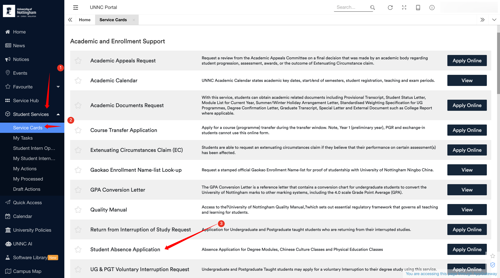
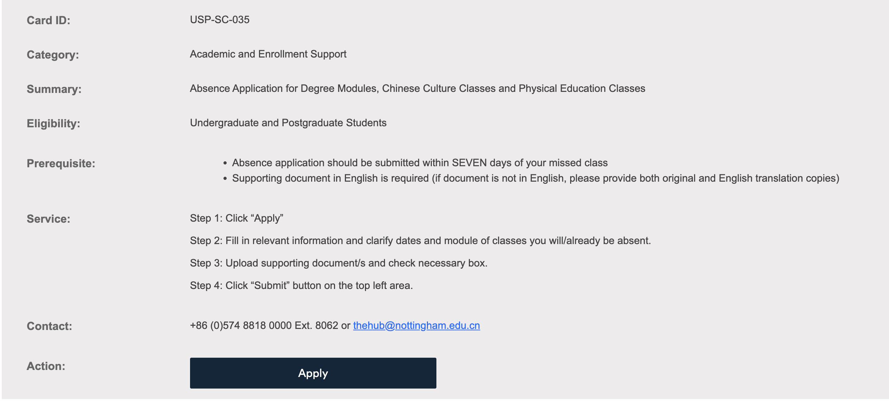

# 请假 / Student Absence Application

如果因故无法参加专业课程、中国文化课或体育课，需要在 UNNC Portal 中提交 Student Absence Application。只向任课老师发送邮件不等于已经完成请假申请，也不代表请假已经获批。

## 申请入口

1. 登录 [UNNC Portal](https://portal.nottingham.edu.cn){ .resource-link }。
2. 在页面右侧菜单中依次进入 `Student Services` → `Service Cards`。
3. 找到 `Student Absence Application`，点击右侧的 `Apply Online`，进入详情页后再点击 `Apply`。

*Student Absence Application 位于 Student Services 的 Service Cards 页面。*

## 申请要求

!!! warning "注意申请期限和证明材料"
    - 请假申请应在缺课之日起 **7 天内**提交。
    - 必须提供**英文证明材料**；如果原始证明不是英文，需要同时上传原件和英文翻译件。

申请时需要填写缺席或预计缺席的日期及相关 Module，并上传证明材料、勾选必要选项，最后点击页面左上方的 `Submit`。填写完成但没有点击 `Submit`，不算正式提交。

*申请页面列出的材料要求与操作步骤。*

如对申请流程有疑问，可联系 The Hub，电话为校内分机 8062，邮箱为 [thehub@nottingham.edu.cn](mailto:thehub@nottingham.edu.cn)。
