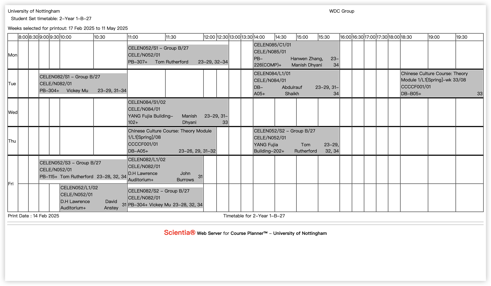
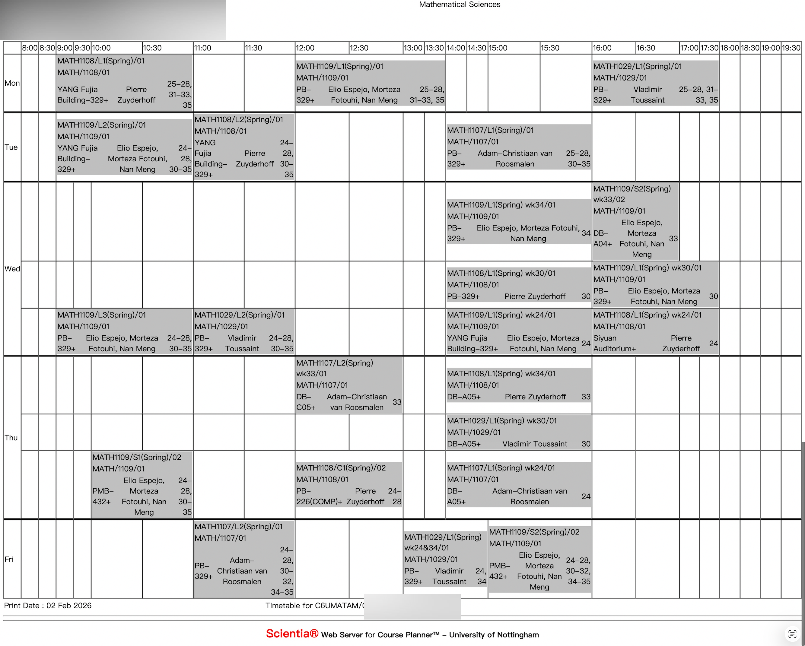

# 基本概念

## 学期安排

1. **学期：** UNNC 每年将安排两个学期，分别称为“秋冬学期”和“春夏学期”，分别对应高中的“上册”和“下册”。每一学期大约有 12 个教学周 + 3 周期末周，上学期会包含一个自习周，安排在期末周之前。前文提到的“期中周”包含在教学周中，你的期末考大概率不会占满期末周。
2. **EEE 专业：** 大二第一学期考试完成后，有一周休假，后跟两周上课。在第二学期期中会有一周休假，期末会提前结课一周。

## 学分

每位同学需在一学年内通过 120 学分的课程。一门课每具备 1 学分，通常代表你在这门课持续期间内需要投入 10 小时（大一你可能不信，大二你会深信不疑的）。

## 课程表

### 课程时间安排

原则上，除中国文化课外（后称 CCC），周一至周五 9:00 至 18:00 均可安排课程。

### 课表与课程时间

每位学生开始上课前几天，会收到来自 Timetabling 的邮件通知你的课程表。你可以拿到完整课表，或将课表导入日历中（Apple 系统）或将课表导入 Outlook 中。学生需要按照课表，在对应时间前往对应地点上课。UNNC 课程时间安排如下表所示（以我大一第二学期课表和大二第一学期课表为例）。学期时间见[校历](../toolkit/calendar.md){ .resource-link }。

*大一第二学期课表示例*

*大二第一学期课表示例*

> **冲突选课：** 冲突选课（如体育课、中国文化课讲座）在通常情况下是不被允许的。如有特殊情况，如因节假日调课导致时间冲突，请向体育课 / 中国文化课小组任课老师当面说明情况，或发邮件说明并请假。

### 如何阅读课表

课表的每一个灰色方块具有如下特质：

1. 第一行为课程编号，如 `CELEN052`；大一课表后面的 Group A / B / C 数字为你的小班班号。
2. 第二行依旧是课程编号。
3. 第三行第一个为上课地点，第二个为任课 tutor / 教授（若有多人则随机一人），第三个为在第几教学周上这门课。因节假日调整课时会在某些周调课，所以有的课会在某一周的奇怪时间上一节。

以上课表中，每一编号相同的课程称为一门课（课程代码相同）。对课程可进行以下分类。

### 按课程开设学期分类

1. **单学期课程：** 只开设在第一学期或第二学期，待结束出分后，可直接在对应学期结束时在 Bluecastle 查到对应分数。
2. **学年课程：** 持续一学年的课程，通常这个时候我们称第一学期期末考为 mid-term exam（期中考试）。在第一学期结束出分时，你不可在 Bluecastle 上查询到第一学期分数，只能等课程负责人将各小项分数登记到 Moodle 上后自行计算。

### 按课程时间长短分类

课表中一个格子时长为 0.5 小时。

1. **2 小时课程：** 为 lecture 性质，除语言课外大概率为大班课。
2. **1 小时课程：** 为 seminar 性质，应为小班上课，主要进行习题讲解或复习等。
3. **1.5 小时课程：** 一般是中国文化课。

### 按课程性质分类

1. **Lecture 课程：** 大家一起上课，通常为一个专业或共享这一门课程的所有专业同学一起上，如大一第一学期 Foundation Physics（MAM、Sta、Eg、CS），大二 MAM 与 Sta 共享全部课程等。
2. **Seminar 课程：** 通常为专业内部分同学组成一个小班上课，时长多为 1 小时。课程内容主要为讲解习题、答疑等。
3. **实验课：** 包括大一 Foundation Physics、Foundation Chemistry（Eg 独占），以及大二部分专业特有课程；实验室通常在 PMB。

### 其他分类

1. **NAA 课程：** 通常为教授们开设的类似兴趣类课程，有兴趣可以报名。学够 40 NAA 学分可获得诺丁汉卓越奖（一张高贵的奖状）。
2. **中国文化课讲座：** 需要你去抢讲座。2+2 同学需在前两年上够至少 5 节，4+0 同学需在前三年上够至少 5 节。一节讲座计 8 分，40 分及格即可。虽说是抢，实际上课程蛮多的，不用着急。
3. **体育课：** 学期中请留意 PE 部门邮件，会提醒你抢体育课。对于大一新同学，需在第一学期先抢一节理论课，即讲解一些注意事项；这节课完全看你什么时候有时间，其余无区别。之后再进行实践课的抢课。
