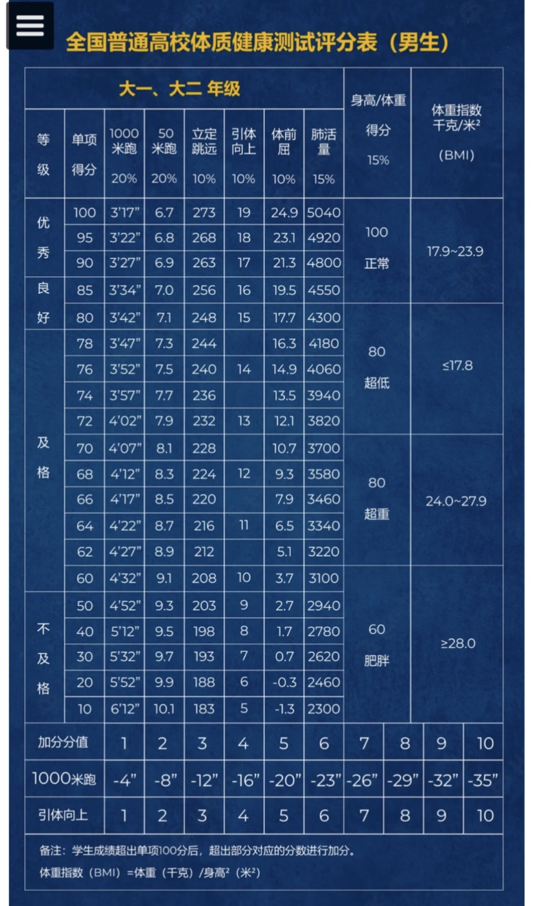
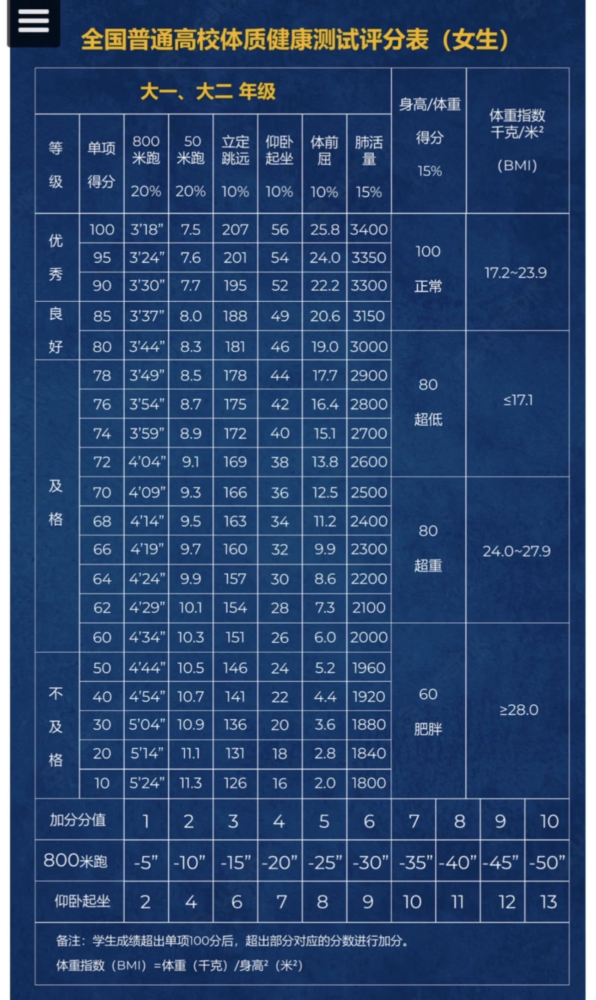

# 培养方案

## 全英文授课

如其名，除中国文化课和部分体育课外（没错，我们体育组也有外国老师），其余课程均为纯英文教学。

## 预科课程

预科课程指大一课程。英国本科通常为三年，而国内普通全日制本科通常为四年，因此增加一年预科课程进行衔接。

### EAP 课程

EAP 课程指语言课，包括：

- 秋季学期：Oral Communication Skills A（10 学分）和 Reading and Writing in Academic Contexts（20 学分）。
- 春季学期：Oral Communication Skills B（10 学分）和 English in Specific Academic Contexts（20 学分）。

!!! warning "通过要求"
    以上四门课程的每一个组成部分都必须超过 40 分，课程才算通过。

计算 EAP 课程分数时，使用前文的[均分公式](basics.md#weighted-average){ .resource-link }代入各门课程成绩和学分即可。

这四门课程共计 60 学分，占大一全年 120 学分的一半，因此也占据大一均分一半的权重，比较重要。

### 专业课程

这里的“专业”需要打上引号，更准确地说，它们是专业适应课程。此类课程难度普遍偏低，一般指除 EAP 课程外的其他大一课程，共同组成大一均分的另一半。此类课程通常总分超过 40 分即算通过。

## 真 · 专业课

这个名字是本指南为了便于区分而起的，指大二、大三和大四年级的课程，强度显著高于大一课程。

## 中国文化课 { #chinese-culture-course }

中国文化课细分为理论课、实践课和研究性系列讲座三部分，三者相互独立。理论课成绩、实践课成绩与研究性系列讲座成绩中任一部分不及格，均不能获得中国文化课成绩证明。

中国文化课达到 40 分即为及格。只要通过，最终成绩不会体现在成绩单上，也不参与均分计算。

### 中国文化课理论课

理论课包含“与历史对话”（大一）和“与哲学对话”（大二）两个必修科目。两个科目的成绩分别达到 40 分及以上，视为理论课成绩合格。

两个科目的组成部分相似，以下为一般安排：

#### 平时成绩

- **小班讨论：** 每学年 2 次，即每学期 1 次，一般安排在学期中。从给定题目中任选其一，小组讨论后由一名或多名成员上台展示，小组之间互相提问；每班通常分为 4–6 个小组。
- **小组展示：** 每学年 1 次，一般安排在秋季学期末。小组需提前准备并制作 PPT 等展示材料，全体组员均需上台展示。
- **课堂表现与课程作业：** 课程作业通常以随堂形式随机发布，可以理解为一种签到。

#### 学年考核

考核要求通常于春季学期初发布，并在春季学期末进行。一般会提前给出约 5 个主题，你可以进行任意程度的准备。考核时会从中随机抽取 2 个题目，每个题目需撰写一篇约 800 字的文章，总时长为 2 小时。

由于各组成部分的占比每年都可能调整，请以当年通知为准。具体比例可前往 `Moodle` → `My Modules` → `Chinese Culture Course` → `课程导引` 查看。

理论课每学年任一科目成绩未达到 40 分者，由教研室安排补考。补考成绩达到 40 分及以上视为通过；补考不通过者，由教研室安排重修。若重修仍不通过，则视为中国文化课成绩不合格。

### 中国文化课实践课 / SPDPO 学分

中国文化课实践课旨在通过丰富多彩的学生活动，为宁波诺丁汉大学学生营造良态化的第二课堂氛围，达到全人培养的目的。

实践课包含项目学分、素质拓展学分、健康安全学分、新生适应学分和国防教育学分。相关活动由学校学生组织、社团和职能部门单独或联合开展，内容丰富、形式多样、寓教于乐。

#### 学分分类

- **项目学分 / 红色学分：** 无上下限。
- **素质拓展学分 / 蓝色学分：** 下限 10 分。
- **健康安全学分 / 黄色学分：** 下限 10 分。
- **新生适应学分 / 绿色学分：** 下限 10 分。
- **国防教育学分 / 黑色学分：** 必修 10 分。

> 本科生参与研究生活动不可获得学分。

##### 1. 项目学分 / 红色学分

项目学分无上下限要求，分为竞赛类项目学分活动和逸知类项目学分活动。竞赛类项目学分活动是指活动中存在评比、投票或得分机制的活动；其他非竞赛类项目学分活动属于逸知类项目学分活动，分值为 3 学分 / 次。

竞赛类项目中，三等奖人数上限为 3 人或 3 组，二等奖人数上限为 2 人或 2 组，一等奖人数上限为 1 人或 1 组。特设奖项最多可设置 3 个，每个奖项人数上限为 1 人或 1 组。凡以小组为单位获得名次，组内所有成员均可获得相应学分，而非由组员平分学分。

校外竞赛获奖者如需获得相应学分，请将个人姓名、赛事相关信息及入围或获奖证明发送至 [yl_SPDPO@nottingham.edu.cn](mailto:yl_SPDPO@nottingham.edu.cn)。

竞赛类项目学分标准如下。校内竞赛由学校部门、学生组织、社团或其他主办方组织；校外竞赛包括在宁诺举办的对外竞赛。

| 竞赛阶段 / 奖项 | 校内竞赛（校级） | 校外竞赛（市级） | 校外竞赛（省级 / 片区级） | 校外竞赛（全国） | 校外竞赛（国际） |
| --- | ---: | ---: | ---: | ---: | ---: |
| 初赛 | 3 | 8 | 10 | 12 | 16 |
| 复赛 | 5 | 10 | 12 | 16 | 18 |
| 决赛 | 6 | 14 | 16 | 18 | 20 |
| 三等奖 | 8 | 18 | 20 | 24 | 26 |
| 二等奖 | 10 | 22 | 24 | 26 | 30 |
| 一等奖 | 12 | 26 | 28 | 30 | 35 |
| 工作人员类 | 4 | 4 | 6 | 9 | 9 |
| 特设奖项 | 15 | 15 | 15 | 18 | 20 |

*省级 / 片区级竞赛包括华东区竞赛等。*

##### 2. 素质拓展学分 / 蓝色学分

素质拓展学分为设下限必修板块，下限为 10 分，分为团日活动、数字化能力发展、职业生涯发展、创新创业四类学分活动。

素质拓展学分活动主办申请面向全校各部门开放，活动分为讲座类（2 学分 / 次）及实践类（4 学分 / 次）。请注意，中国文化课研究性讲座不纳入该板块。

数字化能力发展板块包括线上课程和线下讲座，旨在提升新生在大学学习中所需的数字化能力素养和人工智能素养。其中，线上课程 `Digital Student (UNNC) (25-26)` 将于开学初在 Moodle 上向所有一年级本科生开放，线下讲座信息会在学分系统发布。

##### 3. 健康安全学分 / 黄色学分

健康安全学分为设下限必修板块，下限为 10 分，分为健康、安全、公益志愿服务与 EDI 四类学分活动。健康安全学分活动的主要形式为讲座类（2 学分 / 次）及研讨课（3 学分 / 次）。

##### 4. 新生适应学分 / 绿色学分

新生适应学分为设下限必修板块，下限为 10 分，分为体育团建、新知新学、劳动教育和生活技能、世界语言与文化四类学分活动。

新生适应学分活动的主办方包括宁诺三大学院、宁诺英语语言教学中心、体育部、后勤事务中心、学生事务与发展中心、小语种语言教学中心。活动形式涵盖线上及线下英语语言学习讲座、体育外出课程、劳动技能实践、美学和小语种教育等。

##### 5. 国防教育学分 / 黑色学分

国防教育学分为必修板块。新生入学后参加国防教育训练并通过，可获得 10 分。未满足要求的学生需参加补训并通过，否则直接视为中国文化课实践课部分未通过。

#### 达标条件

本科一年级期间累计修习达到 50 分（含 50 分）及以上，并同时满足除红色学分外各类学分均达到相应下限，视为实践课达标。

若未修满相应学分，需参加补考并通过。

#### 我该去哪里抢学分课程 / 查询学分？

关注“UNNC SPDPO”公众号，点击“学分系统”，获取“学分系统二维码”，扫码后使用学校邮箱账号登录。

如果网站无法打开或无法登录，可依次检查：

1. 是否已连接校园网 `eduroam`。
2. 登录账号是否需要去掉 `.nottingham.edu.cn` 后缀。
3. 是否因尚未正式开学，个人信息还未完全录入系统。
4. 密码是否填写正确。

### 研究性系列讲座

计算周期为大一至大四秋季学期；2+2 同学的计算周期为前两学年。成绩以参与讲座的次数计算，参与 5 次及以上讲座，方视为研究性系列讲座及格。

研究性系列讲座不及格者，由教研室安排补考。补考拟安排在大四春季学期，以参与讲座的方式进行；补考期满后仍未达到 5 次者，视为中国文化课成绩不合格。

## 体育课

体育课成绩由两个模块构成，分别为“体测”和“整体评估”。整体评估包括考勤情况、项目考试等。

### 成绩构成

| 学期类型 | 体测占比 | 整体评估占比 |
| --- | ---: | ---: |
| 有体测的学期（大一上、大二上） | 40% | 60% |
| 没有体测的学期 | — | 100% |

整体评估会因体育课项目和任课老师不同，在具体项目及其占比上有所区别。

### 体测评分标准

大一、大二体测按照全国普通高校学生体质健康测试标准评分。男女生的测试项目和评分要求不同；表中同时列出了各项目占比、BMI 范围及部分项目的加分标准。点击图片可查看原图。

=== "男生"

    

=== "女生"

    

### 不及格、补考与重修

- 体育课成绩介于 40–59 分，视为“不及格”。
- 体育课成绩为 39 分及以下，需要在大三期间重修。
- “不及格”的学生仍有一次补考机会；补考未通过则需要重修。

补考形式为跑步测试：

| 学生 | 及格标准 |
| --- | ---: |
| 男生 | 1000 米，4 分 33 秒以内 |
| 女生 | 800 米，4 分 23 秒以内 |

### 必修要求

根据国家教育部规定，体育课为必修课，中国大陆大一、大二本科学生必须参加。根据学校规定，四个学期的体育合格成绩，是申请本年度奖学金、大三出国交换，以及获得宁波诺丁汉大学学位证书和毕业证书的前提与必要条件。

## 学位

### 授予学位

  <section class="degree-card">
    <h4>工学学士</h4>
    <ul>
      <li>材料成型及控制工程</li>
      <li>电气工程及其自动化</li>
      <li>工业设计</li>
      <li>航空航天工程</li>
      <li>化学工程与工艺</li>
      <li>环境工程</li>
      <li>建筑环境与能源应用工程</li>
      <li>建筑学</li>
      <li>土木工程</li>
    </ul>
  </section>
  <section class="degree-card">
    <h4>理学学士</h4>
    <ul>
      <li>管理科学</li>
      <li>国际经济与贸易</li>
      <li>化学</li>
      <li>计算机科学</li>
      <li>计算机科学与人工智能</li>
      <li>经济学</li>
      <li>数学与应用数学</li>
      <li>统计学</li>
    </ul>
  </section>
  <section class="degree-card">
    <h4>管理学学士</h4>
    <ul>
      <li>大数据管理与应用</li>
      <li>国际商务管理</li>
      <li>国际商务经济学</li>
      <li>国际商务与国际传播学</li>
      <li>国际商务与法语／德语／西班牙语／日语／汉语</li>
      <li>金融财务与管理</li>
    </ul>
  </section>
  <section class="degree-card">
    <h4>文学学士</h4>
    <ul>
      <li>国际传播学</li>
      <li>国际学</li>
      <li>国际学与西班牙语／德语／法语／日语／汉语</li>
      <li>英语研究与国际商务</li>
      <li>英语语言文学</li>
      <li>英语与应用语言学</li>
    </ul>
  </section>
  <section class="degree-card">
    <h4>经济学学士</h4>
    <ul>
      <li>金融科技</li>
    </ul>
  </section>

### 学位等级

宁诺的学士学位分为 4 个等级，依据大三和大四的成绩按不同权重计算。

参考均分算法为：大三成绩占比 $\frac{1}{3}$，大四成绩占比 $\frac{2}{3}$，即：

$$
\text{参考均分}=\text{大三均分}\times\frac{1}{3}+\text{大四均分}\times\frac{2}{3}
$$

具体分类如下：

| 学位等级 | 英文名称 | 参考均分 |
| --- | --- | ---: |
| 一等学位 | First Class Honours | 70 分及以上 |
| 二等一学位（2:1） | Upper Second Class Honours | 60–69 分 |
| 二等二学位（2:2） | Lower Second Class Honours | 50–59 分 |
| 三等学位 | Third Class Honours | 40–49 分 |
