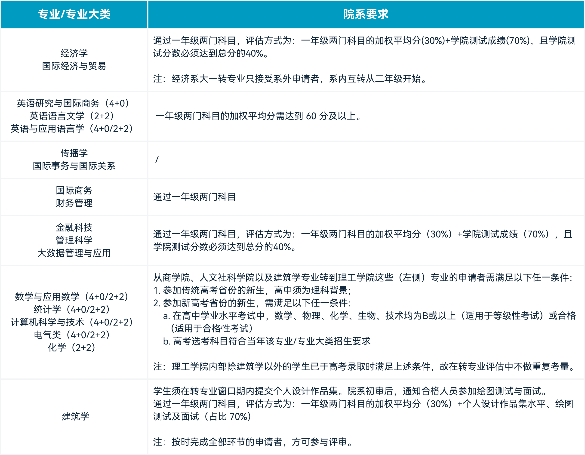

# 转专业政策

学校的转专业政策相对宽松，共有两次常规转专业机会；之后如仍需转专业，可以考虑降级转专业。

## 第一次转专业

第一次转专业通常在大一第一学期末进行，可提交两个转专业志愿。满足目标专业要求后，如需参考两门科目成绩或计算加权平均分，则按照上学期 RWAC（写作课）成绩的 $\frac{2}{3}$ 与 OCSa（口语课）成绩的 $\frac{1}{3}$ 计算，不设置名额上限。

*第一次转专业院系要求；具体条件请以学校当年发布的通知为准。*

## 第二次转专业

第二次转专业的具体安排以当年邮件通知为准。

> 转专业存在一些特殊情况。例如，在同一专业的 2+2 与 4+0 学籍转换之间，可通过邮件提交申请；CS 和 CSAI 专业在后期可以互相转换；第二次转专业时，同一学院下专业互转可能不占用转专业名额。具体政策请以当年通知为准。
