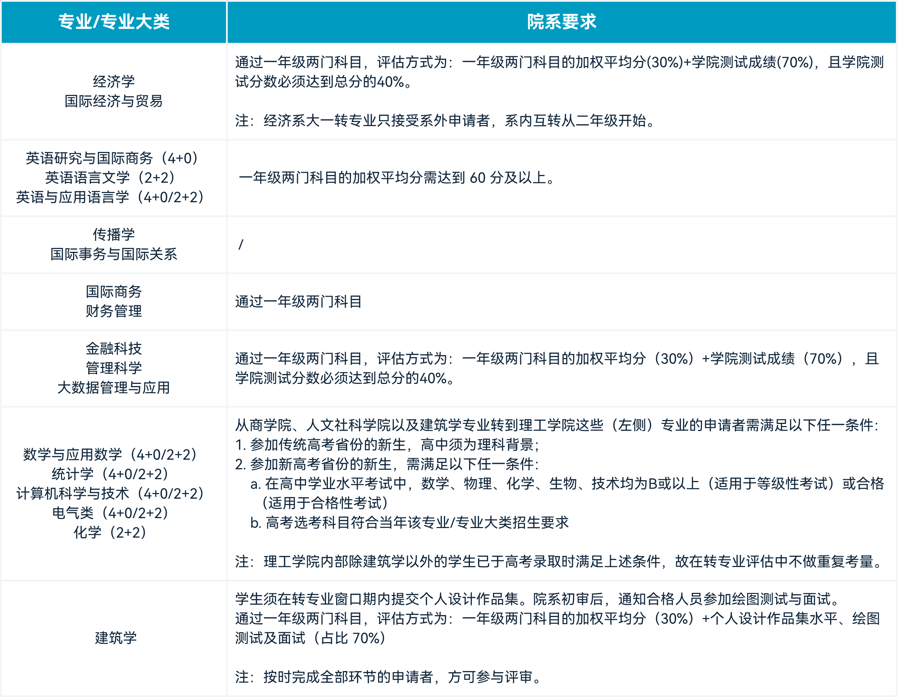
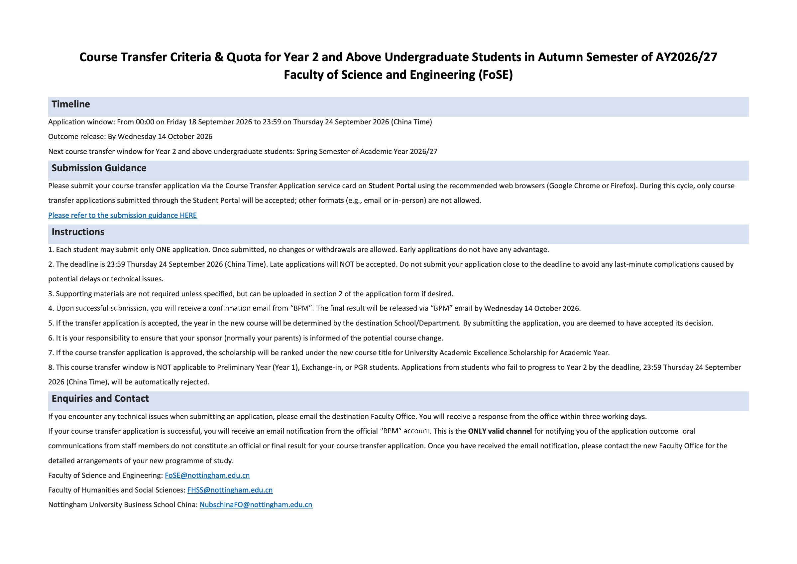
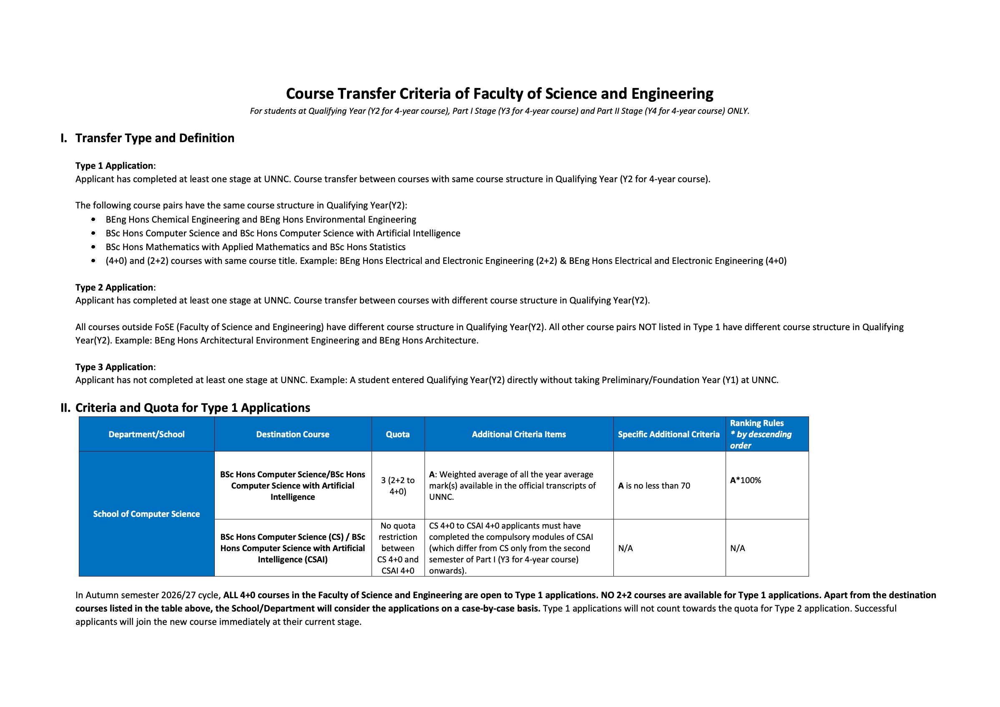
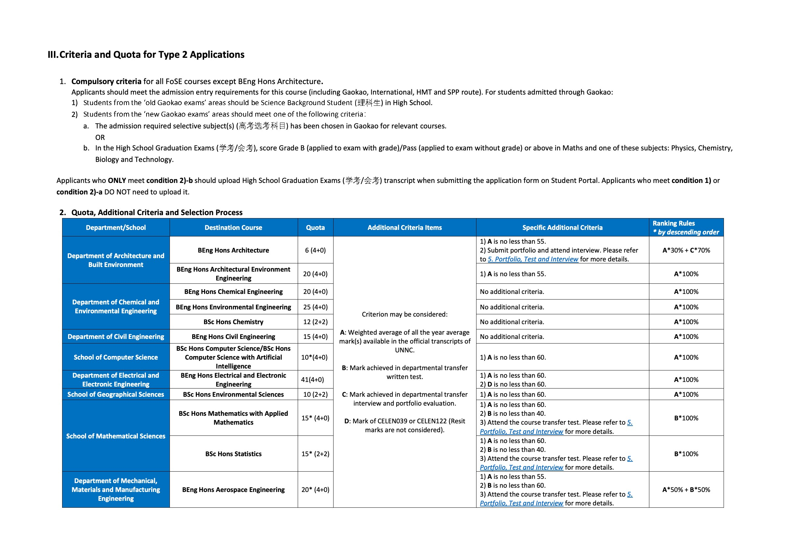
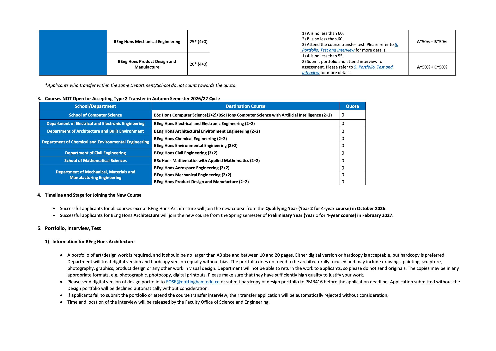
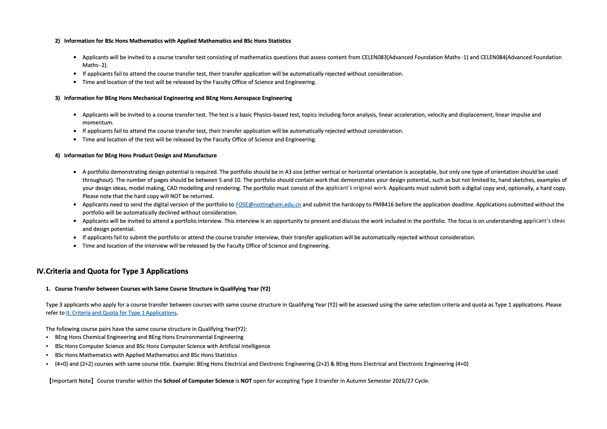
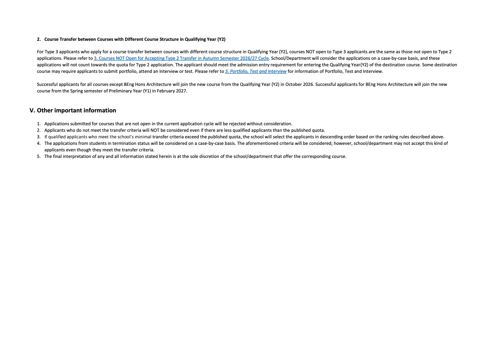

# 转专业政策

转专业是从当前专业或专业类申请调整至另一专业或专业类。它与 2+2 / 4+0 学制选择、专业大类内部的方向分流不是同一件事，办理时间和规则也可能不同。

## 2026 级第一次转专业

2026 级本科新生入学后，可在一年级第一学期末的指定时段内提交专业 / 专业类调整申请。

1. 每名申请者最多可填报两个志愿。
2. 学校将结合目标专业的转专业名额和考核标准进行综合审核。
3. 审核结果于一年级第二学期初统一公布。
4. 转专业获批后，学生自第二学期起正式转入新专业 / 专业类就读。

如果目标专业的考核需要参考一年级两门科目的加权平均分，这里的“两门科目”指 RWAC（写作课）和 OCSa（口语课），计算方式为 RWAC 成绩占 $\frac{2}{3}$、OCSa 成绩占 $\frac{1}{3}$。

不同目标专业可能对一年级课程成绩、学院测试、作品集或其他条件有不同要求。下图可用于了解院系要求的常见形式；2026 级实际开放专业、名额和考核标准，应以入学后发布的《转专业政策及指南》为准。

*第一次转专业院系要求参考；具体条件请以 2026 级当年发布的通知为准。*

## 第二次转专业

这次转专业一般会在**开学前 1–2 周通过邮件通知**，并在**开学后的 Week 1 或 Week 2 周末通过邮件通知结果**。因此，本次转专业面向**从大一成功升入大二的同学，以及更高年级的同学（即降转）**。

理工学院 **2026/27 学年秋季轮次的原文件见下**，可直接滚动预览或下载。

[查看 / 下载理工学院 2026/27 学年秋季大二及以上本科生转专业条件与名额（PDF，6 页）](../assets/documents/2026-27-autumn-y2-course-transfer-fose.pdf){ .resource-link target="_blank" rel="noopener" }

{ loading="lazy" }
{ loading="lazy" }
{ loading="lazy" }
{ loading="lazy" }
{ loading="lazy" }

**以下是原文件的中文要点总结**，具体安排以当轮邮件通知为准。

### 本轮时间与申请方式

| 事项 | 2026/27 学年秋季轮次安排 |
| --- | --- |
| 申请时间 | **2026 年 9 月 18 日 00:00 至 9 月 24 日 23:59（北京时间）** |
| 结果公布 | **2026 年 10 月 14 日前**，通过 BPM 邮件通知 |
| 申请入口 | Student Portal 中的 **Course Transfer Application** 服务卡片 |

每名学生只能提交**一份申请**，提交后**不能修改或撤回**；提前申请没有录取优势，逾期申请不予受理。本轮申请只接受 Student Portal 提交，邮件或现场递交不能代替系统申请；作品集等附加材料则按专业要求另行提交。推荐使用 Chrome 或 Firefox。

提交成功后会收到 BPM 确认邮件；**提交确认不等于转专业获批**。最终结果以 BPM 正式邮件为准，工作人员的口头答复不构成最终结果。获批后需联系目标学院安排后续学习，转入年级由目标院系决定。学生还应告知资助人（通常为家长）可能发生的专业变更；获批后，学年学业优秀奖学金将按新专业参与排名。

### 理工学院如何区分申请类型

文件中的 **Type 1 / 2 / 3 是申请类别，不是第几次申请**。

| 类型 | 适用情况 | 本轮主要安排 |
| --- | --- | --- |
| **Type 1** | 已在宁诺完成至少一个学习阶段，转入专业与原专业的大二课程结构相同 | 所有理工学院 4+0 专业开放，2+2 专业不开放；获批后立即在当前学习阶段转入，不占 Type 2 名额 |
| **Type 2** | 已在宁诺完成至少一个学习阶段，转入专业与原专业的大二课程结构不同 | 按下表中的专业门槛、名额和排序规则选拔；从理工学院以外专业转入属于课程结构不同的情况 |
| **Type 3** | 尚未在宁诺完成一个学习阶段，例如未在宁诺读大一而直接入读大二的新生 | 同结构申请参照 Type 1，但本轮不开放计算机学院内部的 Type 3 转专业；不同结构申请由院系逐案审核，不占 Type 2 名额，需满足目标专业大二入学要求，可能要求作品集、面试或笔试 |

文件认定的大二课程结构相同的组合包括：**化学工程与环境工程、计算机科学与计算机科学（人工智能）、数学与应用数学与统计学，以及同名专业的 4+0 与 2+2**。其他专业组合按课程结构不同处理。Type 3 不同结构申请的不开放专业与 Type 2 相同。

Type 1 中，计算机科学 / 计算机科学（人工智能）从 **2+2 转 4+0 共列 3 个名额**，要求下文定义的 A ≥ 70，按 A 排序；CS 4+0 与 CSAI 4+0 之间无名额限制，但 CS 转 CSAI 需完成 CSAI 要求的必修课程，两者从大三第二学期起存在课程差异。其他 Type 1 申请由院系逐案审核。

### Type 2：入学背景、名额与成绩要求

除建筑学外，申请者应满足目标专业的入学要求，包括对应的高考、国际生、港澳台或 SPP 入学路径。通过高考入学的学生，还需满足下列条件：

- **旧高考地区：** 高中须为理科背景。
- **新高考地区：** 满足目标专业的高考选考科目要求；或学考 / 会考的**数学及物理、化学、生物、技术四门中至少一门**达到 B 等及以上（有等级制）或合格及以上（无等级制）。
- 如果只符合上述学考 / 会考条件，须在 Student Portal 申请时上传学考 / 会考成绩单；符合旧高考理科条件或新高考选科条件的，无须上传该成绩单。

下表为 **Type 2 本轮名额**。成绩符号沿用原文件，均按分数从高到低排序：

- **A：** 宁诺正式成绩单中所有已有学年均分的加权平均，具体计算以院系审核为准。
- **B：** 院系转专业笔试成绩。
- **C：** 院系面试及作品集评估成绩。
- **D：** CELEN039 或 CELEN122 成绩，**不采用补考成绩**。

| 目标专业 | 开放学制 | 名额 | 额外门槛 / 考核 | 排序依据 |
| --- | --- | ---: | --- | --- |
| 建筑学（Architecture） | 4+0 | 6 | A ≥ 55；作品集及面试 | 30% A + 70% C |
| 建筑环境工程（Architectural Environment Engineering） | 4+0 | 20 | A ≥ 55 | A |
| 化学工程（Chemical Engineering） | 4+0 | 20 | 无额外条件 | A |
| 环境工程（Environmental Engineering） | 4+0 | 25 | 无额外条件 | A |
| 化学（Chemistry） | 2+2 | 12 | 无额外条件 | A |
| 土木工程（Civil Engineering） | 4+0 | 15 | 无额外条件 | A |
| 计算机科学 / 计算机科学（人工智能）（CS / CSAI） | 4+0 | 共 10* | A ≥ 60 | A |
| 电气与电子工程（Electrical and Electronic Engineering） | 4+0 | 41 | A ≥ 60，D ≥ 60 | A |
| 环境科学（Environmental Sciences） | 2+2 | 10 | A ≥ 60 | A |
| 数学与应用数学（Mathematics with Applied Mathematics） | 4+0 | 15* | A ≥ 60，B ≥ 40；参加笔试 | B |
| 统计学（Statistics） | 2+2 | 15* | A ≥ 60，B ≥ 40；参加笔试 | B |
| 航空航天工程（Aerospace Engineering） | 4+0 | 20* | A ≥ 55，B ≥ 60；参加笔试 | 50% A + 50% B |
| 机械工程（Mechanical Engineering） | 4+0 | 25* | A ≥ 60，B ≥ 60；参加笔试 | 50% A + 50% B |
| 产品设计与制造（Product Design and Manufacture） | 4+0 | 20* | A ≥ 55；作品集及面试 | 50% A + 50% C |

\* 原表带星号项目中，同一系 / 学院（Department / School）内部转专业的申请者不占该名额；这里不指整个理工学院内部。

“无额外条件”仍需满足上述入学背景要求。**名额未满也不降低最低条件**；达到最低条件的人数超过名额时，按表中规则择优录取。处于 termination status（终止学籍状态）的申请由院系逐案考虑，即使达到最低条件，也可能不获接收。

本轮 Type 2 **不开放**以下专业的 **2+2** 转入：CS / CSAI、电气与电子工程、建筑环境工程、化学工程、环境工程、土木工程、数学与应用数学、航空航天工程、机械工程、产品设计与制造。申请本轮未开放的专业将直接被拒绝；不能把某专业开放的 4+0 名额理解为其 2+2 也开放。

### 获批后从哪个年级开始

**转专业可能延长修读时间，并非一定保持原年级。** 按本轮理工学院文件：

| 申请情况 | 转入时间与年级 |
| --- | --- |
| Type 1 | 获批后立即在当前学习阶段转入 |
| Type 2，以及 Type 3 中大二课程结构不同的申请：**除建筑学以外专业** | **2026 年 10 月从大二（Qualifying Year）开始** |
| Type 2，以及 Type 3 中大二课程结构不同的申请：**建筑学** | **2027 年 2 月从大一春季学期开始** |

Type 3 同结构申请的具体转入安排应向目标院系确认。提交申请即视为接受目标院系对转入年级的决定，申请前应结合毕业时间和学习费用考虑。

### 作品集、笔试与面试

| 专业 | 需要提前准备的内容 |
| --- | --- |
| 建筑学 | 不大于 A3、10–20 页的艺术 / 设计作品集，不要求只做建筑作品；电子版或纸质版均接受、同等评估，院系偏好纸质版。截止前发送电子版至 FoSE 邮箱，或将纸质版交至 PMB416；纸质材料不退回，不要提交原件。另需参加面试 |
| 数学与应用数学、统计学 | 数学笔试，范围为 CELEN083（Advanced Foundation Maths–1）和 CELEN084（Advanced Foundation Maths–2） |
| 机械工程、航空航天工程 | 基础物理笔试，包括受力分析、直线加速度、速度与位移、线性冲量与动量 |
| 产品设计与制造 | A3、5–10 页、统一横向或纵向的原创作品集，可含手绘、设计构思、模型、CAD 建模与渲染等；截止前发送电子版至 FoSE 邮箱，另需参加作品集面试；纸质版提交地点为 PMB416，材料不退回 |

!!! note "产品设计与制造的纸质作品集要求需向学院确认"
    原文件第 5 页先写纸质版可选（“optionally”），下一条又写需提交纸质版。两处表述不一致，申请时应向 FoSE 确认；电子版作品集和面试是明确要求。

需要作品集的专业，未交作品集会被拒绝；需要笔试或面试的专业，缺席考核也会被拒绝。具体考核时间和地点由理工学院办公室另行通知。

### 申请指南与咨询

下列 Moodle 操作指南为原文件第 1 页所附链接，可能需要学校账号登录。

- [Student Portal 转专业申请操作指南（Moodle）](https://moodle.nottingham.ac.uk/pluginfile.php/13128234/mod_folder/content/0/Student%20Guidance%20Course%20Transfer%20Application.pdf){ .resource-link target="_blank" rel="noopener" }
- 理工学院：[FoSE@nottingham.edu.cn](mailto:FoSE@nottingham.edu.cn)
- 人文与社会科学学院：[FHSS@nottingham.edu.cn](mailto:FHSS@nottingham.edu.cn)
- 商学院：[NubschinaFO@nottingham.edu.cn](mailto:NubschinaFO@nottingham.edu.cn)

提交遇到技术问题时，应联系**目标学院**办公室；本轮文件说明办公室会在三个工作日内回复。

!!! info "这几件事不要混在一起"
    简单来说，转专业、学制选择和大类分流是三套不同的流程：

    - **转专业：** 从现在的专业申请转到另一个专业，具体申请时间和操作方法看学校发布的《转专业政策及指南》。
    - **学制选择：** 在本专业提供的 4+0 和 2+2 之间作出选择。
    - **大类分流：** 已被某个专业大类录取后，再选择大类内的具体专业或方向。

    大一的初次学制选择和大类分流通常由学院另行通知。**选定后再申请变更，可能需要走转专业流程**：例如本轮理工学院文件将同名专业的 2+2 / 4+0 转换列入 Type 1，并设有开放方向、名额和成绩条件。详见[学制选择与专业分流](pathways.md){ .resource-link }。
